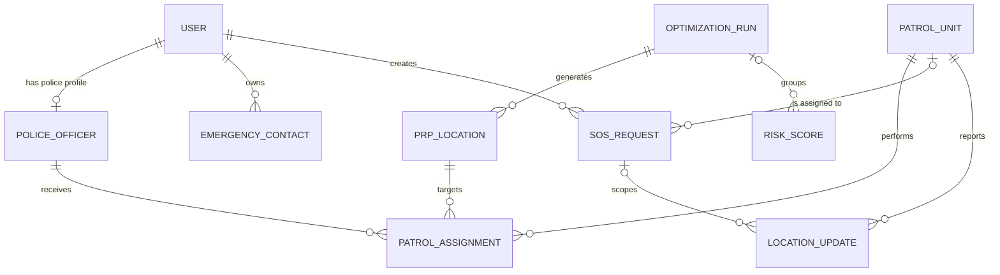

# SafeZone Database Foundation

## Scope

SafeZone uses PostgreSQL with PostGIS as its production database. SQLAlchemy 2.x supplies the typed ORM architecture, `asyncpg` supplies asynchronous PostgreSQL connectivity, GeoAlchemy2 maps spatial columns, and Alembic is the only supported schema-migration mechanism.

Stage 2 defines persistence and relationships only. It does not add CRUD APIs, authentication behavior, risk calculations, PRP optimization, patrol allocation, or SOS dispatch logic.

## Domain relationship model



PRP locations and SOS requests deliberately have no relationship to an optimization trigger. PRPs represent strategic positioning for a shift; SOS requests represent real-time emergencies assigned to an available patrol unit by a later dispatch service.

## Tables

### `users`

Stores one identity per person with UUID, name, unique email, password hash, role (`ADMIN`, `POLICE`, or `CITIZEN`), active state, and audit timestamps. Password hashes are persistence fields only; hashing and authentication begin in Stage 3.

### `police_officers`

One-to-one operational extension of a `POLICE` user. It stores a unique badge/service identifier and availability (`AVAILABLE`, `ASSIGNED`, `OFF_DUTY`, or `UNAVAILABLE`) without introducing unrelated HR information.

### `patrol_units`

Stores deployable operational units independently from officers and permanent stations. Status supports availability, assignment, response, off-duty, and out-of-service states.

### `crime_incidents`

Stores category, severity from 1–5, WGS84 location, occurrence/report times, optional ward/area, status, and creation time. Location uses `geography(Point,4326)` and a GiST index.

### `optimization_runs`

Stores run time, JSONB parameters, available patrol count, configured coverage radius in meters, run status, and optional failure reason. This is the reproducibility root for strategic PRP results.

### `prp_locations`

Stores dynamic WGS84 patrol positioning points, risk/covered-risk metadata, coverage radius, shift window, generation time, state, and the generating optimization run. State distinguishes candidates, approved/active results, inactive results, and rejected results.

### `patrol_assignments`

Joins a patrol unit and police officer to a PRP for a bounded shift. This represents strategic allocation only and does not represent SOS dispatch.

### `sos_requests`

Stores the citizen, emergency location, creation/update times, optional assigned patrol unit, and the lifecycle:

```text
PENDING -> ASSIGNED -> ACCEPTED -> EN_ROUTE -> ARRIVED -> RESOLVED
```

`CANCELLED` is available for an approved cancellation path. Transition enforcement belongs in the later dispatch service, not in route handlers or this persistence stage.

### `location_updates`

Stores timestamped patrol-unit locations, optional SOS scope, and optional reported accuracy. Retention and live-update policy are intentionally deferred to the live-location stage.

### `emergency_contacts`

Stores private contacts owned by a user. Contacts are deleted with the owner and are never shared operationally by default.

### `risk_scores`

Stores normalized 0–1 scores, WGS84 point, explainable JSONB components, model/configuration version, calculation time, and optional optimization-run provenance. It stores computed evidence without claiming predictive machine learning.

## Geospatial convention

Every operational point is stored once as PostGIS `geography(Point,4326)`. The point is WGS84 and its coordinate order is longitude (`X`) followed by latitude (`Y`). Separate latitude and longitude database columns are intentionally avoided so values cannot drift out of sync. Later schemas and service boundaries may accept or return latitude/longitude while converting to and from this single authoritative point.

Spatial tables use GiST indexes:

- `crime_incidents.location`
- `prp_locations.location`
- `sos_requests.location`
- `location_updates.location`
- `risk_scores.location`

Distances and radii are represented in meters. The PRP coverage radius is persisted per run/location and remains configurable; no business logic hard-codes the 3 km prototype default.

## Database infrastructure

- `app/database/base.py`: declarative base, naming conventions, UUID and timestamp mixins.
- `app/database/session.py`: validated async PostgreSQL engine and session factory.
- `app/database/dependencies.py`: FastAPI async session dependency with rollback on failure.
- `alembic/env.py`: async online migrations and offline SQL generation using model metadata.
- `alembic/versions/20260820_0001_database_foundation.py`: initial PostGIS schema migration.

The database URL must begin with `postgresql+asyncpg://`; production configuration rejects SQLite and synchronous PostgreSQL drivers.

## Migration commands

From `backend/` with its virtual environment active and a configured `.env`:

```powershell
python -m alembic current
python -m alembic upgrade head
python -m alembic downgrade -1
```

The PostgreSQL database user must be permitted to create the PostGIS extension, or an administrator must run this once in the target database:

```sql
CREATE EXTENSION IF NOT EXISTS postgis;
```

The downgrade removes SafeZone tables and enum types but intentionally leaves the shared PostGIS extension installed.
